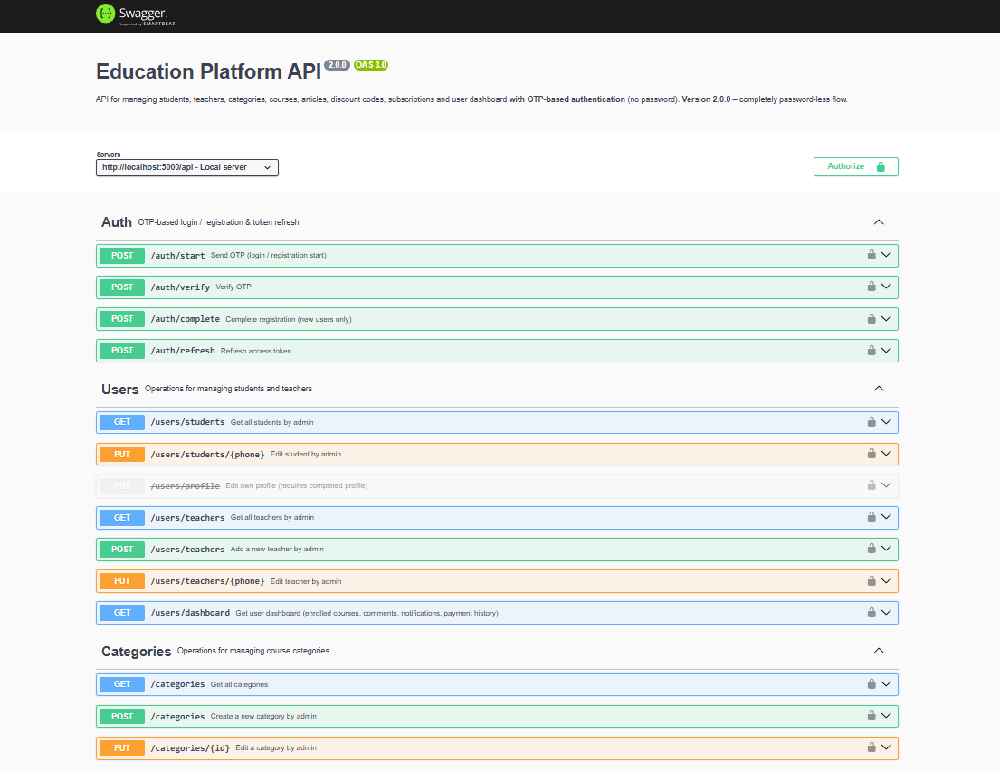
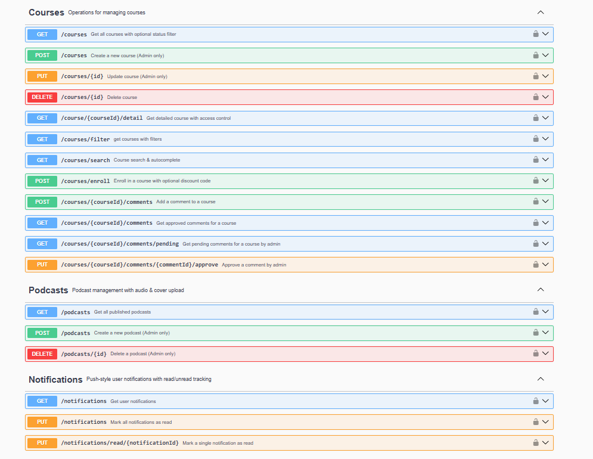
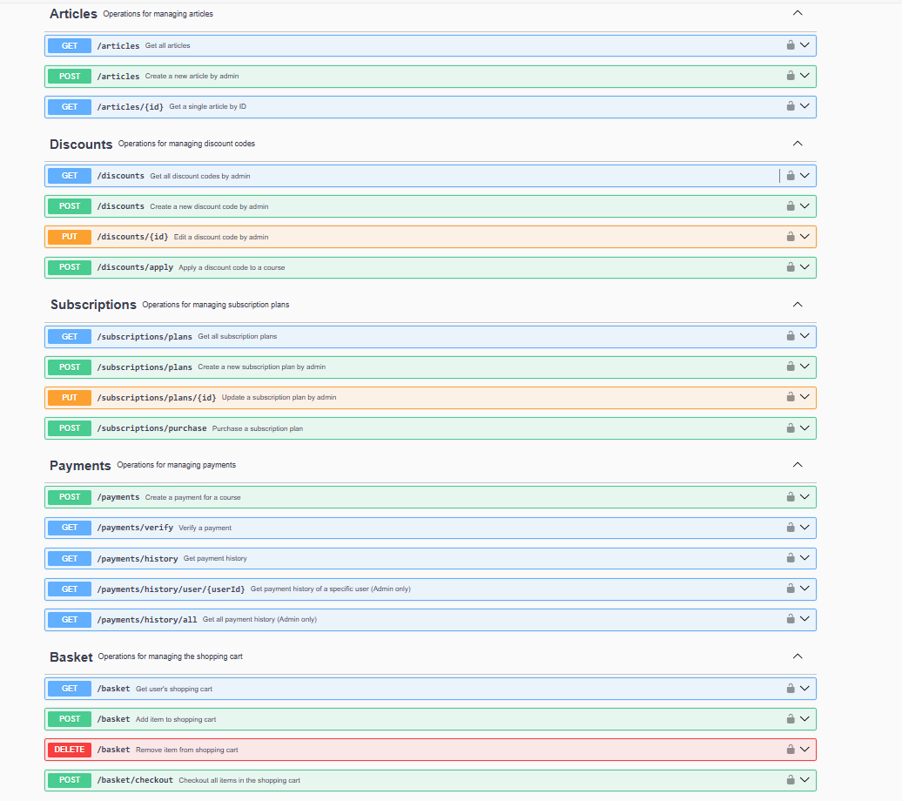
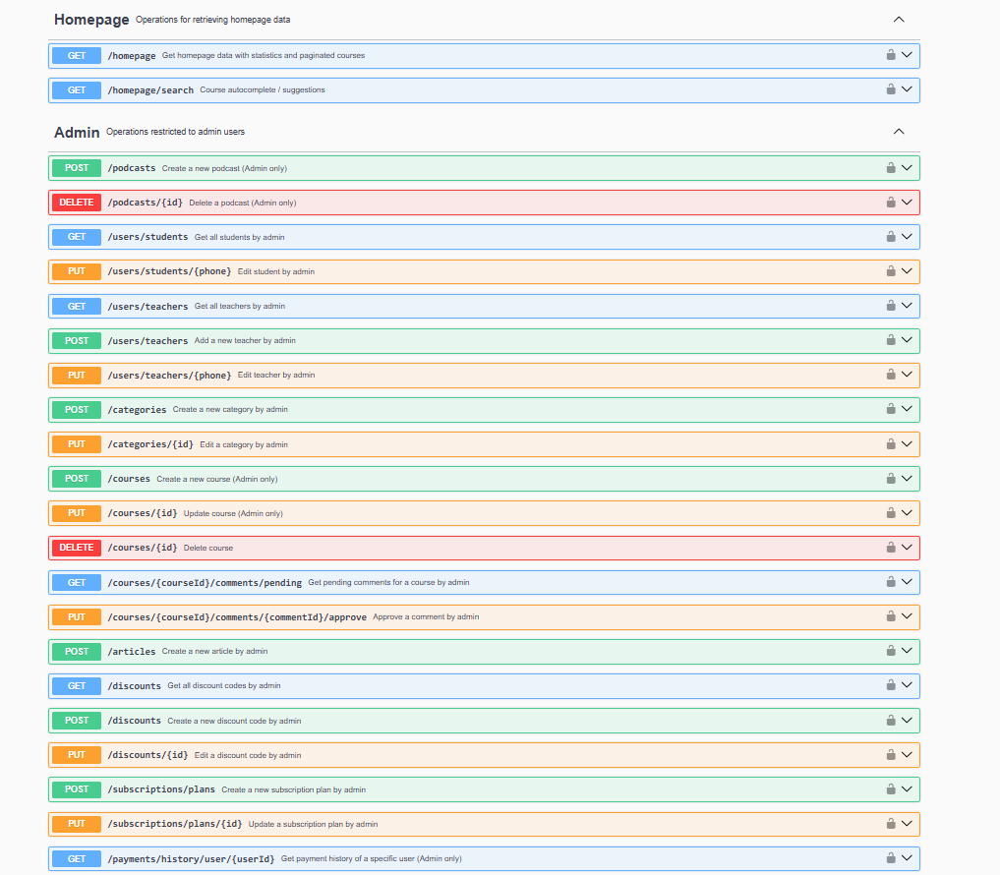

```markdown
# Education Platform API (v2.0.0)

A modern, password-less RESTful API for an online education platform built with Node.js. This API manages courses, podcasts, articles, users (students & teachers), subscriptions, payments, notifications, and more — with a fully OTP-based authentication flow.

**Version 2.0.0** introduces a complete password-less authentication system and enhanced course status logic.

Base URL (local development):  
`http://localhost:5000/api`

## Main Features

- **Password-less Authentication** via phone number + OTP
- User roles: `student`, `teacher`, and implicit `admin`
- Course management with smart status handling (`pre-register`, `last-week`, `active`, `sold-out`, etc.)
- External video/audio hosting (cover uploads only, main content from external CDN)
- Podcast management with external audio links
- Article system
- Discount codes (single-use or multi-use)
- VIP subscription plans
- Shopping cart with combined course + subscription purchases
- Payment gateway (authority/refId flow – e.g., ZarinPal)
- Push-like notifications with read/unread tracking
- Advanced course filtering, search, and autocomplete
- Full user and admin dashboards

## Technologies Used (Inferred)

- Node.js + Express
- MongoDB (24-hex character IDs)
- JWT for session management
- Multer or similar for file uploads (covers only)
- OTP sending service (SMS gateway)
- External CDN for videos and audios

## Authentication Flow (Password-less)

1. `POST /auth/start` → Send OTP to phone
2. `POST /auth/verify` → Verify OTP  
   - Existing user → get `accessToken` + `refreshToken`  
   - New user → get `tempUserId` + `requiresCompletion: true`
3. New users: `POST /auth/complete` → Complete profile (name + email) → get tokens
4. `POST /auth/refresh` → Renew access token

All protected endpoints require:
```http
Authorization: Bearer <accessToken>
```

## Key Endpoints

### Authentication
- `POST /auth/start`
- `POST /auth/verify`
- `POST /auth/complete`
- `POST /auth/refresh`

### Courses
- `GET /courses` → List courses
- `GET /courses/filter` → Advanced filter + pagination
- `GET /courses/search` → Autocomplete search
- `GET /course/{courseId}/detail` → Full course details with access control
- `POST /courses/enroll` → Enroll (free or paid)
- `POST /courses/{courseId}/comments` → Submit comment (requires approval)

### Podcasts (Admin only for create/delete)
- `GET /podcasts` → All published podcasts
- `POST /podcasts` → Create (multipart: cover + external audio link)
- `DELETE /podcasts/{id}`

### User Dashboard
- `GET /users/dashboard` → Enrolled courses, comments, notifications, payment history

### Shopping Cart
- `GET /basket`
- `POST /basket` → Add course or subscription
- `DELETE /basket` → Remove item
- `POST /basket/checkout` → Checkout

### Admin Only
- Manage students/teachers
- Create/edit categories, courses, articles, discount codes, subscription plans
- Approve comments
- View all payments

## Smart Course Status Logic (displayStatus)

Priority for auto-calculating `displayStatus`:

1. Manual status set by admin (always prioritizes)
2. Auto rules:
   - If `registrationEnd` ≤ 7 days left → `last-week`
   - Capacity full or `soldOutOverride=true` → `sold-out`
3. Otherwise → same as manual status

## Suggested Project Structure

```
src/
├── controllers/
├── routes/
├── models/
├── middlewares/       # auth, admin, upload
├── services/          # OTP, payment, notification
├── utils/
├── config/
└── app.js
```

## Environment Variables (Sample)

```env
PORT=5000
MONGODB_URI=mongodb://localhost:27017/education-platform
JWT_ACCESS_SECRET=your_very_strong_secret
JWT_REFRESH_SECRET=another_very_strong_secret
OTP_SERVICE_API_KEY=...
SMS_GATEWAY_URL=...
PAYMENT_GATEWAY_URL=https://www.zarinpal.com/pg/...
UPLOAD_PATH=./uploads
```

## Local Run

1. Clone the repository
2. `npm install`
3. Set up `.env` file
4. Connect to MongoDB
5. `npm run dev`

## API Documentation

This repository includes full OpenAPI 3.0.3 specs (provided YAML file). For graphical view, use:

- [Swagger Editor](https://editor.swagger.io) → Paste the YAML
- Redoc or Swagger UI (locally)

## Contributing

We welcome contributions! Please:
- Open an issue for major changes first
- Follow existing code style
- Write tests if possible

## Screenshots

<div align="center">
  <h4>🏠 Project Images</h4>

  <table>
    <tr>
        <td></td>
        <td></td>
    </tr>
    <tr>
        <td></td>
        <td></td>
    </tr>
    <tr>
        <td></td>
    </tr>
  </table>
</div>

```
